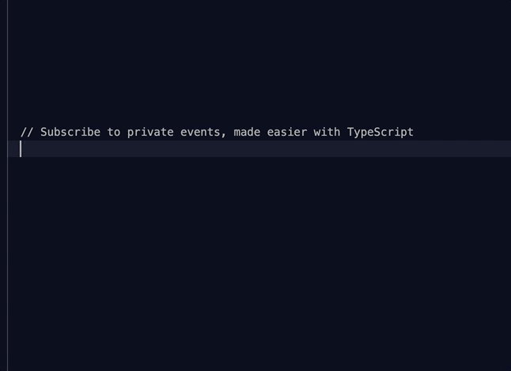
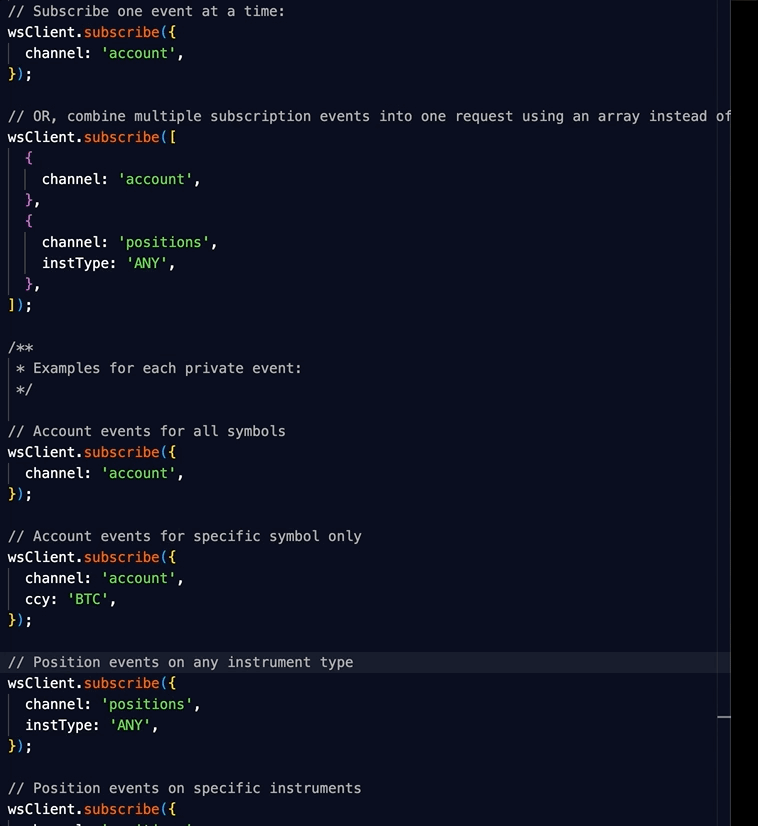

# Node.js & Typescript OKX (OKEX) API & WebSocket SDK

[](https://github.com/tiagosiebler/okx-api/actions/workflows/e2etest.yml) [][1] [][1] [][1] [][1] [](https://www.codefactor.io/repository/github/tiagosiebler/okx-api)

[][1]

[1]: https://www.npmjs.com/package/okx-api

Complete, updated & performant node.js SDK for the OKX(OKEX) APIs and WebSockets:

- Complete integration with all OKX APIs, including the v5 APIs.
- TypeScript support (with type declarations for most API requests & responses).
- Over 100 end-to-end tests making real API calls & WebSocket connections, validating any changes before they reach npm.
- Robust WebSocket integration
  - Configurable connection heartbeats (automatically detect failing connections).
  - Automatic reconnect then resubscribe workflows.
  - Automatic authentication and heartbeat handling.
- Browser support (via webpack bundle - see "Browser Usage" below).

## Installation

```bash
npm install okx-api
```

## Issues & Discussion

- Issues? Check the [issues tab](https://github.com/tiagosiebler/okx-api/issues).
- Discuss & collaborate with other node devs? Join our [Node.js Algo Traders](https://t.me/nodetraders) engineering community on telegram.

## Related projects

- Try my connectors:
  - [binance](https://www.npmjs.com/package/binance)
  - [bybit-api](https://www.npmjs.com/package/bybit-api)
  - [bitget-api](https://www.npmjs.com/package/bitget-api)
  - [okx-api](https://www.npmjs.com/package/okx-api)
  - [ftx-api](https://www.npmjs.com/package/ftx-api)
- Try my misc utilities:
  - [orderbooks](https://www.npmjs.com/package/orderbooks)
- Check out my examples:
  - [awesome-crypto-examples](https://github.com/tiagosiebler/awesome-crypto-examples)

## Documentation

Most methods accept JS objects. These can be populated using parameters specified by okx's API documentation, or check the type definition in the rest-client class methods.

- [RestClient](src/rest-client.ts).
- [OKX API Documentation](https://www.okx.com/docs-v5/en/#rest-api).

## Structure

This project uses typescript. Resources are stored in 3 key structures:

- [src](./src) - the whole connector written in typescript
- [lib](./lib) - the javascript version of the project (compiled from typescript). This should not be edited directly, as it will be overwritten with each release. This is also the version published to npm.
- [dist](./dist) - the packed bundle of the project for use in browser environments (manual, using webpack).
- [examples](./examples) - some implementation examples & demonstrations. Contributions are welcome!

---

# Usage

Create API credentials at okx

- [OKX my-api](https://www.okx.com/account/my-api)

## REST Client

### Requests & Responses

- If your IDE doesn't have IntelliSense, check the [rest-client.ts](./src/rest-client.ts) for a list of methods, params & return types.
- Requests follow the same ordering and format as the categories in the [API docs](https://www.okx.com/docs-v5/en/#rest-api).
- Responses are parsed automatically for less nesting. Error responses are thrown in full:
  - If the response looks successful (HTTP 200 and "code" in the response body === "0"), only the `data` property is directly (without the `code`, `data` & `msg` properties).
  - If the response looks like an error (HTTP error OR the "code" property in the response does not equal "0"), the full response is thrown (including `code` and `msg` properties). See the interface for [APIResponse<T>](./src/types/rest/shared.ts).

## Websocket Client

This connector includes a high-performance node.js & typescript websocket client for the OKX public & private websockets.

- If your IDE doesn't have IntelliSense, check the [websocket-client.ts](./src/websocket-client.ts) for a list of methods, params & return types.
- When subscribing to channels, only the "args" should be passed as an object or array when calling the websocket client subcribe() function: [API docs](https://www.okx.com/docs-v5/en/#websocket-api-subscribe).
- TypeScript recommended (but it is not required) for a richer experience:
  
- The ws client will automatically open connections as needed when subscribing to a channel.
- If the connection is lost for any reason, the ws client will detect this (via the connection heartbeats). It will then:
  - Automatically teardown the dead connection.
  - Automatically respawn a fresh connection.
  - Automatically reauthenticate, if using private channels.
  - Automatically resubscribe to previously subscribed topics.
  - Resume producing events as before, without extra handling needed in your logic.
- The ws client will automatically authenticate if accounts are provided and a private channel is subscribed to.
- Up to 100 accounts are supported on the private connection, as per the [API docs](https://www.okx.com/docs-v5/en/#websocket-api-login). Authentication is automatic if accounts are provided.
- For examples in using the websocket client, check the examples in the repo:
  - Private channels (account data): [examples/ws-private.ts](./examples/ws-private.ts)
  - Public chanels (market data): [examples/ws-public.ts](./examples/ws-public.ts)
  - These examples are written in TypeScript, so can be executed with ts-node for easy testing:
    `ts-node examples/ws-private.ts`
  - Or convert them to javascript:
    - Change the `import { ... } from 'okx-api'` to `const { ... } = require('okx-api');`
    - Rename the file to `ws-private.js`
    - And execute with node: `node examples/ws-private.js`

### Public Events

See [examples/ws-public.ts](./examples/ws-public.ts) for a full example:


### Private Events

See [examples/ws-private.ts](./examples/ws-private.ts) for a full example:



## Browser Usage

Build a bundle using webpack:

- `npm install`
- `npm build`
- `npm pack`

The bundle can be found in `dist/`. Altough usage should be largely consistent, smaller differences will exist. Documentation is still TODO.

---

## Contributions & Thanks

### Donations

#### tiagosiebler

Support my efforts to make algo trading accessible to all - register with my referral links:

- [Bybit](https://www.bybit.com/en-US/register?affiliate_id=9410&language=en-US&group_id=0&group_type=1)
- [Binance](https://www.binance.com/en/register?ref=20983262)
- [OKX](https://www.okx.com/join/18504944)

Or buy me a coffee using any of these:

- BTC: `1C6GWZL1XW3jrjpPTS863XtZiXL1aTK7Jk`
- ETH (ERC20): `0xd773d8e6a50758e1ada699bb6c4f98bb4abf82da`

### Contributions & Pull Requests

Contributions are encouraged, I will review any incoming pull requests. See the issues tab for todo items.

## Star History

[](https://star-history.com/#tiagosiebler/bybit-api&tiagosiebler/binance&tiagosiebler/orderbooks&tiagosiebler/okx-api&tiagosiebler/bitget-api&tiagosiebler/awesome-crypto-examples&tiagosiebler/ftx-api&Date)
